# 🚀 To-Do App — Production Ready Flutter Application

A scalable and production-ready To-Do List application built using **Flutter**, following **Clean Architecture + MVVM**, integrated with **Firebase Authentication** and **Cloud Firestore**.

## 🔐 Authentication Flow

<p align="center">
  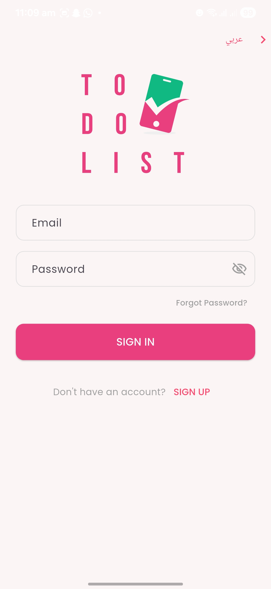
  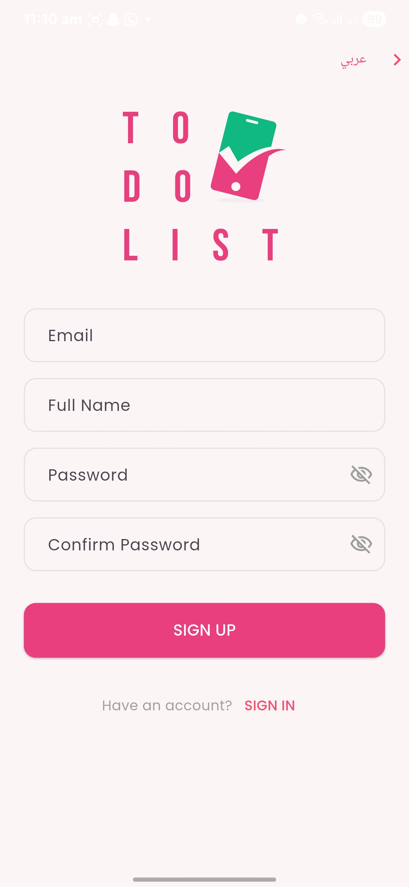
</p>

<p align="center">
  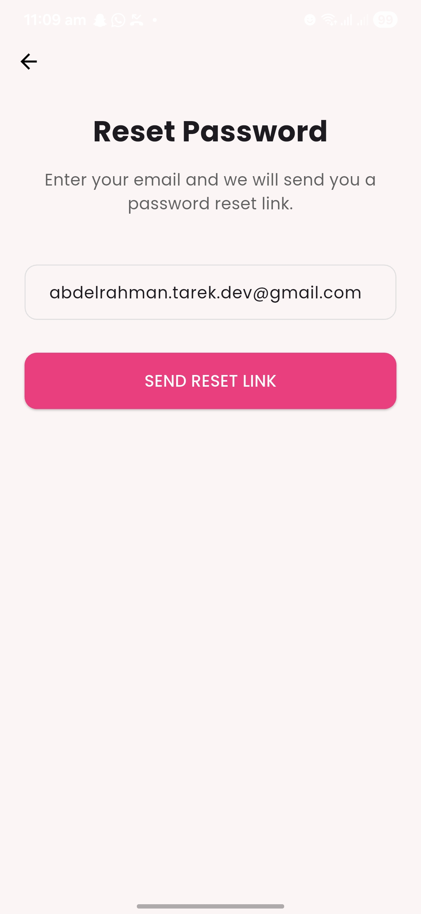
  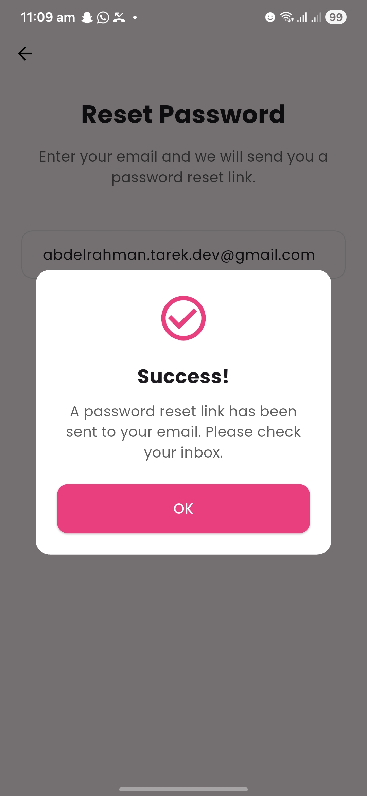
  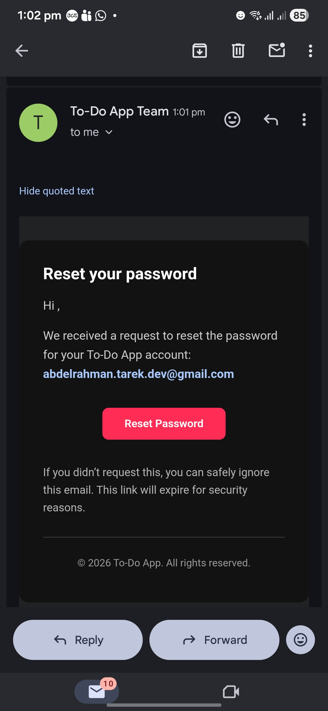
</p>

---

## 📝 Task Management

<p align="center">
  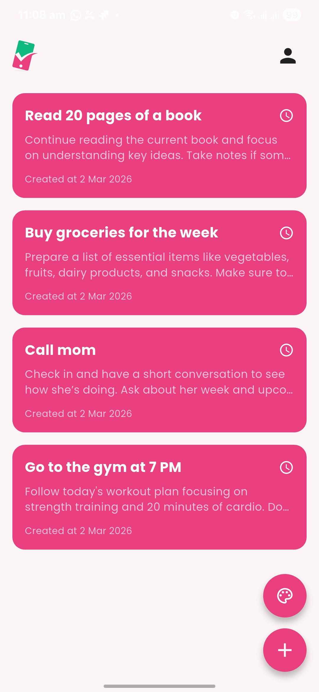
  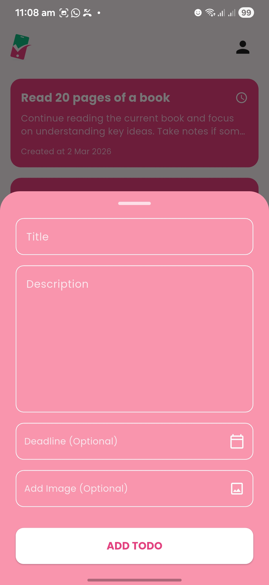
  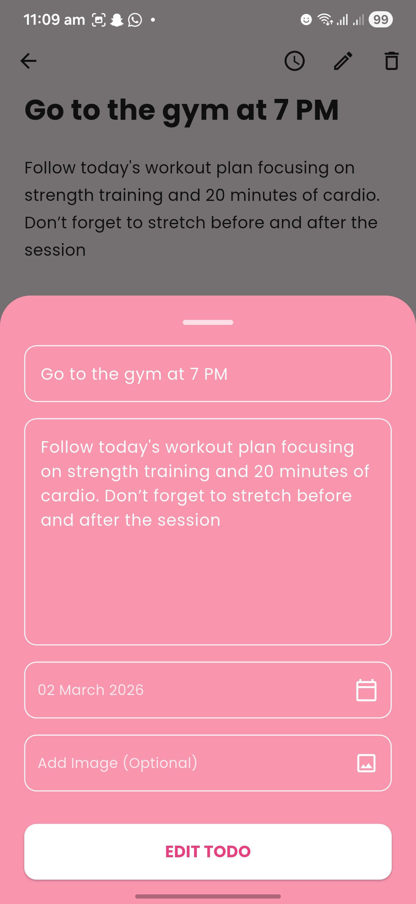
</p>

<p align="center">
  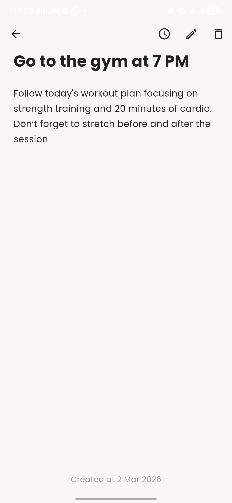
  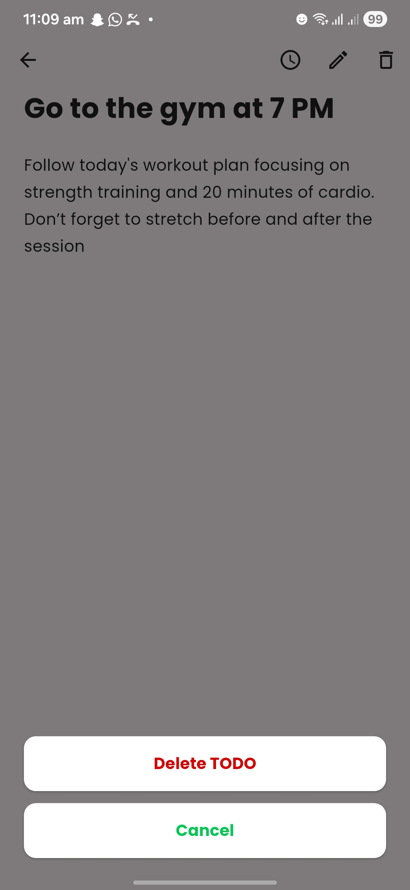
</p>

---

## 👤 Profile

<p align="center">
  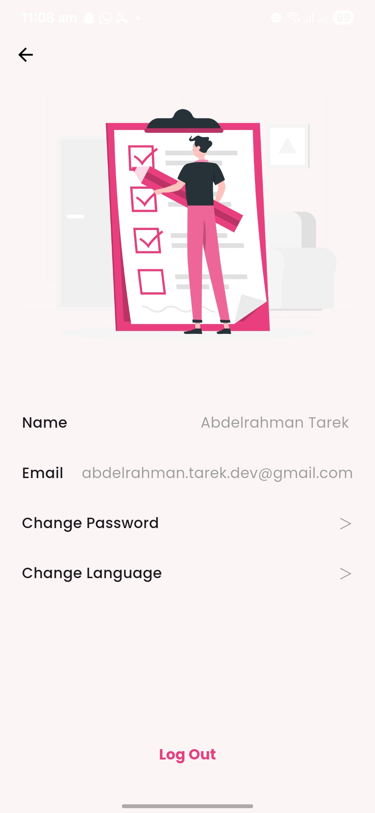
</p>

---

# 📑 Table of Contents

- [Overview](#-overview)
- [Architecture](#-architecture)
- [Project Structure](#-project-structure)
- [Features](#-features)
- [Firebase Integration](#-firebase-integration)
- [Validation System](#-validation-system)
- [Localization](#-localization)
- [State & Dependency Management](#-state--dependency-management)
- [Testing](#-testing)
- [Tech Stack](#-tech-stack)
- [Getting Started](#-getting-started)
- [Future Improvements](#-future-improvements)

---

# 📌 Overview

This project demonstrates how to build a **scalable, maintainable, and testable Flutter application** using real production standards:

- Clean Architecture
- MVVM
- Dependency Injection
- Firebase Authentication
- Cloud Firestore
- Localization
- Unit & Widget Testing

---

# 🏗️ Architecture

The application strictly follows **Clean Architecture principles** to separate responsibilities and improve scalability.

### Layers:

- **Presentation Layer**
- **Domain Layer**
- **Data Layer**

Each layer depends only on the layer beneath it.

---

## 📂 Project Structure

```text
lib/
├── core/
│   ├── services/
│   ├── providers/
│   ├── theme/
│   ├── utils/
│   └── widgets/
│
├── features/
│   ├── auth/
│   │   ├── data/
│   │   │   ├── datasource/
│   │   │   ├── models/
│   │   │   └── repository/
│   │   │
│   │   ├── domain/
│   │   │   ├── entities/
│   │   │   ├── repository/
│   │   │   └── usecases/
│   │   │
│   │   └── presentation/
│   │       ├── viewmodels/
│   │       ├── views/
│   │       └── widgets/
│   │
│   └── todo/
│       ├── data/
│       │   ├── datasource/
│       │   ├── models/
│       │   └── repository/
│       │
│       ├── domain/
│       │   ├── entities/
│       │   ├── repository/
│       │   └── usecases/
│       │
│       └── presentation/
│           ├── viewmodels/
│           ├── views/
│           └── widgets/
│
└── injection_container.dart
```


---

# ✨ Features

- Secure Email & Password Authentication
- Persistent Login Session
- Add / Edit / Delete Tasks
- Real-time Task Synchronization
- Bottom Sheet UI for task management
- Custom reusable UI components
- Multi-language support (Arabic & English)

---

# 🔥 Firebase Integration

## 🔐 Authentication
- Email & Password Login
- Secure Registration
- Firebase error handling
- Persistent user session

## ☁️ Firestore
- User-specific task storage
- Real-time updates
- Clean data structure

---

# 🛡️ Validation System

The app implements a **two-layer validation approach**:

## 1️⃣ Client-Side Validation
- Email format validation
- Password strength validation
- Instant feedback during typing

## 2️⃣ Server-Side Validation
- Firebase exception mapping
- Error messages displayed under input fields
- Handles:
  - Invalid credentials
  - Email already exists
  - Weak password

---

# 🌍 Localization

- 🇺🇸 English Support
- 🇪🇬 Arabic Support
- Runtime language switching
- RTL & LTR layout adaptation
- ARB-based translation system

---

# ⚙️ State & Dependency Management

- **Provider** → State Management
- **GetIt** → Dependency Injection
- Service registration handled in:


injection_container.dart


---

# 🧪 Testing

Includes:

- Validation tests
- Authentication logic tests
- ViewModel behavior tests

Ensuring:
- Business logic reliability
- Safer future refactoring
- Stable authentication flow

---

# 🛠️ Tech Stack

- Flutter
- Dart
- Firebase Authentication
- Cloud Firestore
- Provider
- GetIt
- Clean Architecture
- MVVM
- Localization (ARB)
- Unit Testing
- Widget Testing

---

# 🚀 Getting Started

## 1️⃣ Clone the repository


git clone <your-repository-url>


## 2️⃣ Install dependencies


flutter pub get


## 3️⃣ Setup Firebase

- Add `google-services.json` inside `android/app/`
- Add `GoogleService-Info.plist` inside `ios/Runner/`

## 4️⃣ Run the application


flutter run


---

# 📈 Future Improvements

- Dark Mode
- Task Categories
- Push Notifications
- Profile Screen
- Task Analytics Dashboard

---

# 👨‍💻 Author

**Abdelrahman Tarek**  
Flutter Developer

---

⭐ If you find this project helpful, feel free to give it a star!
